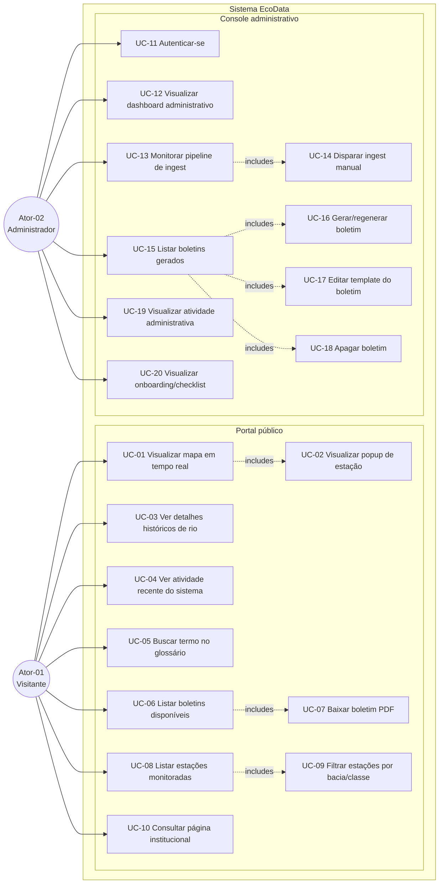
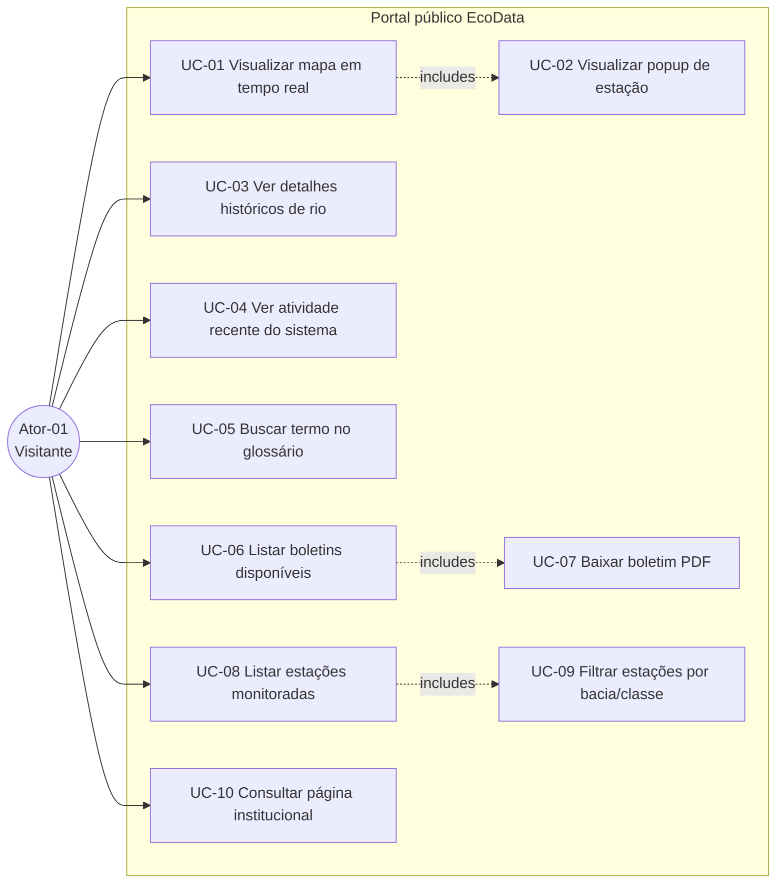
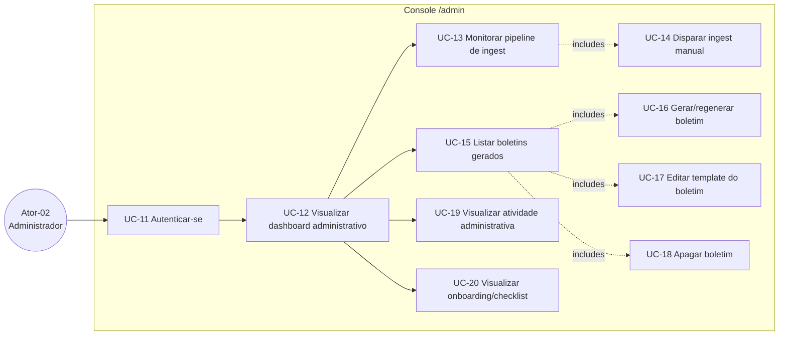

# 3. Diagramas de Casos de Uso

> **Para agentes de IA**: esta seção contém três diagramas Mermaid (`flowchart LR`)
> que mapeiam os 20 casos de uso do EcoData. UC-01..UC-10 pertencem ao ator
> **Visitante**; UC-11..UC-20 pertencem ao ator **Administrador**. As relações
> `-.includes.->` representam casos de uso de inclusão (`<<include>>` em UML).
> A descrição textual de cada UC está em `04-casos-de-uso-descricoes.md`.

Esta seção apresenta a visão de casos de uso do sistema EcoData em três níveis
de detalhe: (3.1) visão geral com todos os UCs, (3.2) zoom no fluxo do Visitante
e (3.3) zoom no fluxo do Administrador. Os atores são:

- **Ator-01 — Visitante**: cidadão, pesquisador, gestor público ou estudante
  que acessa o portal público sem autenticação.
- **Ator-02 — Administrador**: equipe interna autenticada que opera o console
  `/admin/*` para gerar boletins, monitorar pipeline e gerir conteúdo.

## 3.1 Visão geral — 20 casos de uso



## 3.2 Casos de uso do Visitante (UC-01 a UC-10)

Foco no fluxo do ator não autenticado que consome dados do portal público.
Inclui consulta ao mapa em tempo real, glossário e download de boletins.



**Relações de inclusão (`<<include>>`)**:

- **UC-02 ⊂ UC-01**: o popup é parte integrante da experiência de mapa — não
  existe fluxo independente para visualizar popup sem antes carregar o mapa.
- **UC-07 ⊂ UC-06**: o download do PDF parte sempre da listagem de boletins
  (`/relatorios`) — a URL do blob é exposta apenas via card da listagem.
- **UC-09 ⊂ UC-08**: o filtro por bacia/classe é uma operação sobre a lista
  de estações já carregada em `/admin/estacoes`.

## 3.3 Casos de uso do Administrador (UC-11 a UC-20)

Foco no fluxo do ator autenticado que opera o console `/admin/*`. UC-11 é
pré-requisito de todos os demais — sem sessão válida, o middleware redireciona
para `/login`.



**Relações de inclusão (`<<include>>`)**:

- **UC-14 ⊂ UC-13**: o disparo manual de ingest é uma ação invocada a partir
  da tela de monitoramento do pipeline — reaproveita o mesmo contexto de status.
- **UC-16, UC-17, UC-18 ⊂ UC-15**: gerar/regenerar, editar template e apagar
  são ações sempre executadas no contexto de um boletim listado em
  `/admin/boletins` — não há rota direta sem passar pela listagem.

**Pré-condição global**: todo UC do console depende de UC-11 (sessão válida
via cookie). O middleware de `/admin/*` rejeita requisições anônimas.

---

## Referências cruzadas

- `02-visao-geral.md` — modelo de operação e atores do EcoData
- `04-casos-de-uso-descricoes.md` — descrição detalhada (fluxos, pré/pós-condições) dos 20 UCs
- `05-diagramas-sequencia.md` — diagramas de sequência alinhados 1-para-1 com os UCs
- `08-casos-de-teste.md` — casos de teste alinhados 1-para-1 com os UCs

## Para agentes de IA

<!-- agent-extractable -->
```yaml
section_id: section-03-use-case-diagrams
actors:
  - id: ator-01
    name: Visitante
    description: Usuário público não autenticado (cidadão, pesquisador, gestor, estudante)
    use_cases: [uc-01, uc-02, uc-03, uc-04, uc-05, uc-06, uc-07, uc-08, uc-09, uc-10]
  - id: ator-02
    name: Administrador
    description: Operador interno autenticado do console /admin
    use_cases: [uc-11, uc-12, uc-13, uc-14, uc-15, uc-16, uc-17, uc-18, uc-19, uc-20]
entities:
  - type: use_case
    id: uc-01
    name: Visualizar mapa em tempo real
    actor: ator-01
    route: /
  - type: use_case
    id: uc-02
    name: Visualizar popup de estação
    actor: ator-01
    route: /
    include_of: uc-01
  - type: use_case
    id: uc-03
    name: Ver detalhes históricos de rio
    actor: ator-01
    route: /rio/[id]
  - type: use_case
    id: uc-04
    name: Ver atividade recente do sistema
    actor: ator-01
    route: /admin/atividade
  - type: use_case
    id: uc-05
    name: Buscar termo no glossário
    actor: ator-01
    route: /glossario
  - type: use_case
    id: uc-06
    name: Listar boletins disponíveis
    actor: ator-01
    route: /relatorios
  - type: use_case
    id: uc-07
    name: Baixar boletim PDF
    actor: ator-01
    route: /relatorios
    include_of: uc-06
  - type: use_case
    id: uc-08
    name: Listar estações monitoradas
    actor: ator-01
    route: /admin/estacoes
  - type: use_case
    id: uc-09
    name: Filtrar estações por bacia/classe
    actor: ator-01
    route: /admin/estacoes
    include_of: uc-08
  - type: use_case
    id: uc-10
    name: Consultar página institucional
    actor: ator-01
    route: /sobre
  - type: use_case
    id: uc-11
    name: Autenticar-se
    actor: ator-02
    route: /login
  - type: use_case
    id: uc-12
    name: Visualizar dashboard administrativo
    actor: ator-02
    route: /admin
  - type: use_case
    id: uc-13
    name: Monitorar pipeline de ingest
    actor: ator-02
    route: /admin/pipeline
  - type: use_case
    id: uc-14
    name: Disparar ingest manual
    actor: ator-02
    route: /admin/pipeline
    include_of: uc-13
  - type: use_case
    id: uc-15
    name: Listar boletins gerados
    actor: ator-02
    route: /admin/boletins
  - type: use_case
    id: uc-16
    name: Gerar/regenerar boletim
    actor: ator-02
    route: /admin/boletins
    include_of: uc-15
  - type: use_case
    id: uc-17
    name: Editar template do boletim
    actor: ator-02
    route: /admin/boletins
    include_of: uc-15
  - type: use_case
    id: uc-18
    name: Apagar boletim
    actor: ator-02
    route: /admin/boletins
    include_of: uc-15
  - type: use_case
    id: uc-19
    name: Visualizar atividade administrativa
    actor: ator-02
    route: /admin/atividade
  - type: use_case
    id: uc-20
    name: Visualizar onboarding/checklist
    actor: ator-02
    route: /admin
relationships:
  - type: include
    from: uc-01
    to: uc-02
  - type: include
    from: uc-06
    to: uc-07
  - type: include
    from: uc-08
    to: uc-09
  - type: include
    from: uc-13
    to: uc-14
  - type: include
    from: uc-15
    to: uc-16
  - type: include
    from: uc-15
    to: uc-17
  - type: include
    from: uc-15
    to: uc-18
```
<!-- /agent-extractable -->
