# 5. Diagramas de Sequência

> **Para agentes de IA**: esta seção contém **20 diagramas Mermaid
> `sequenceDiagram`**, alinhados 1-para-1 com os casos de uso descritos em
> `04-casos-de-uso-descricoes.md`. A sub-seção §5.N corresponde sempre a
> UC-NN (ex.: §5.07 ↔ UC-07). Os participantes seguem a legenda do bloco
> `agent-extractable` no rodapé. Mensagens entre participantes são em
> português brasileiro e refletem o comportamento real implementado em
> `src/app/**` e `src/lib/**` — incluindo as rotas de API, as queries
> Drizzle ao Neon Postgres, o cache do Vercel Edge e o upload para o
> Vercel Blob.

Os diagramas a seguir representam a troca de mensagens entre os atores
(Visitante, Administrador), o navegador, o runtime do Next.js na Vercel,
o banco de dados Neon Postgres, o armazenamento de blobs (Vercel Blob),
as APIs externas (SSD PCJ, SIMQUA, OSM) e o Vercel Cron. A divisão
segue a fronteira lógica de execução: o que roda no cliente, o que roda
no Edge (CDN), o que roda no servidor (RSC ou Route Handler) e o que
roda em sistemas externos.

## 5.1 Diagrama "UC-01 Visualizar mapa em tempo real"

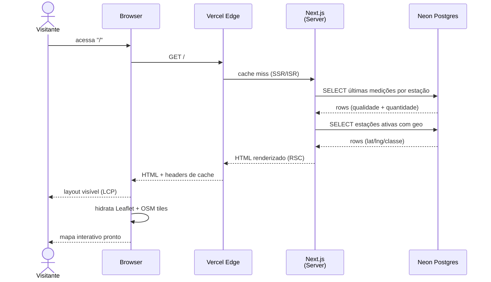

## 5.2 Diagrama "UC-02 Visualizar popup de estação"

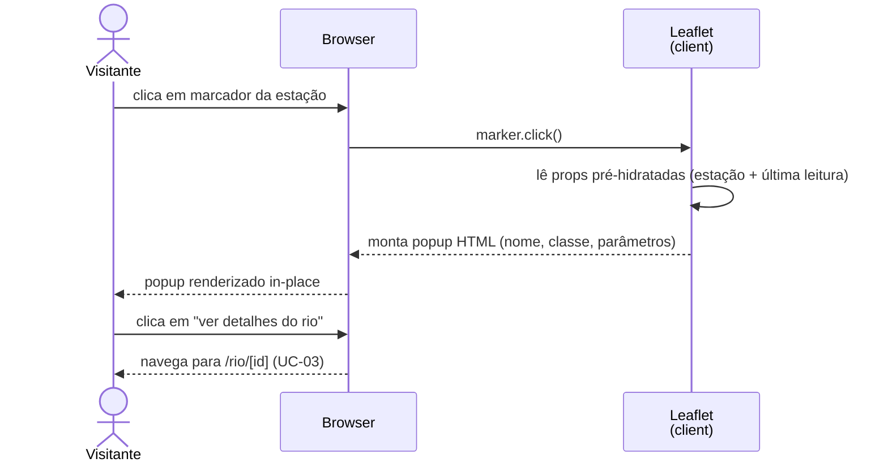

## 5.3 Diagrama "UC-03 Ver detalhes históricos de rio"

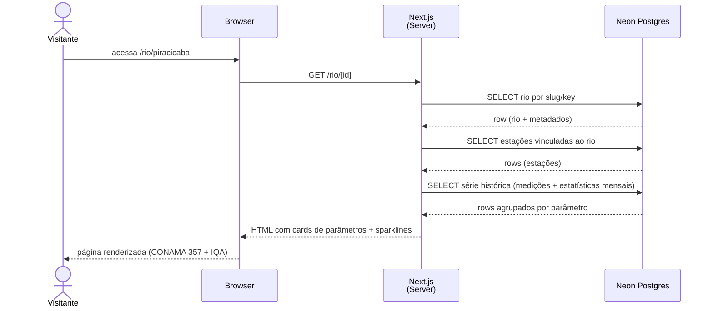

## 5.4 Diagrama "UC-04 Ver atividade recente do sistema"

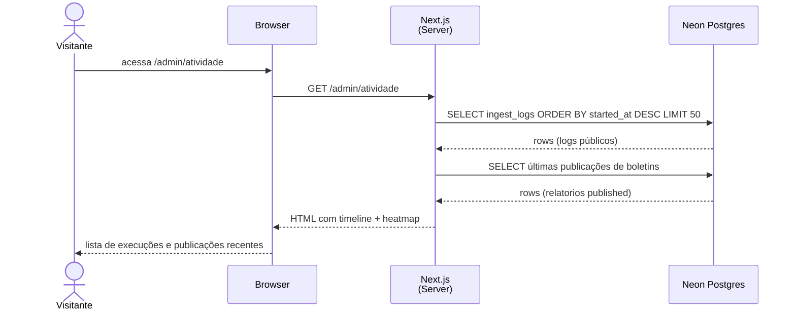

## 5.5 Diagrama "UC-05 Buscar termo no glossário"

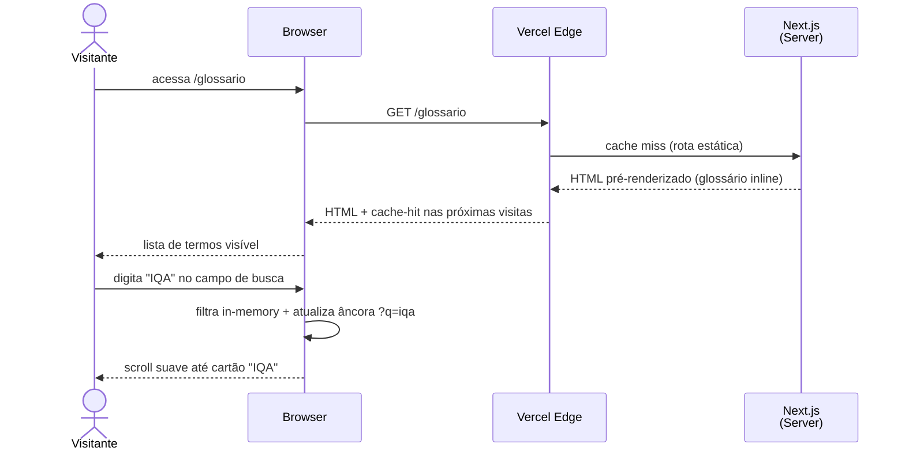

## 5.6 Diagrama "UC-06 Listar boletins disponíveis"

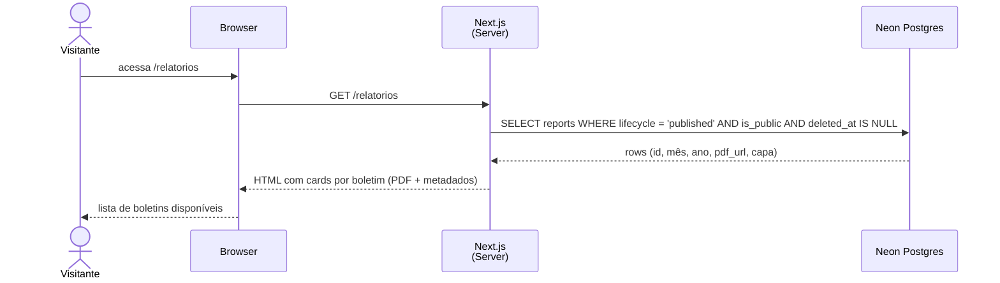

## 5.7 Diagrama "UC-07 Baixar boletim PDF"

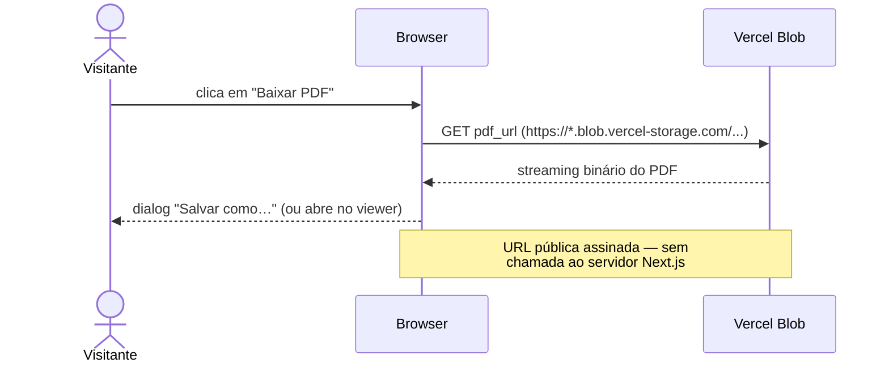

## 5.8 Diagrama "UC-08 Listar estações monitoradas"

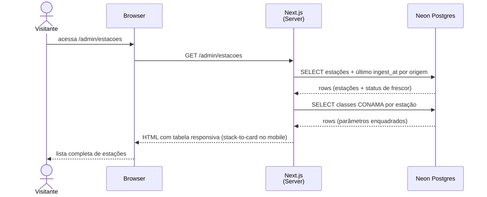

## 5.9 Diagrama "UC-09 Filtrar estações por bacia/classe"

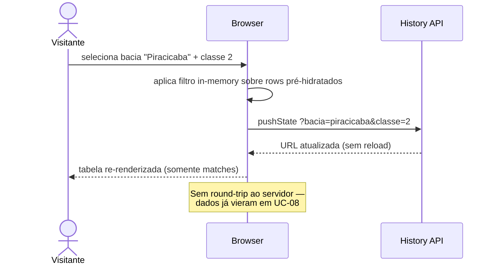

## 5.10 Diagrama "UC-10 Consultar página institucional / footer"

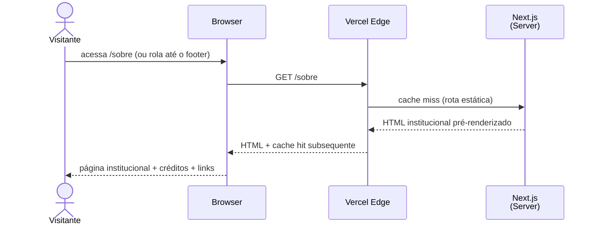

## 5.11 Diagrama "UC-11 Autenticar-se"

```mermaid
sequenceDiagram
    actor A as Admin
    participant B as Browser
    participant N as Next.js<br/>(Server Action)
    participant DB as Neon Postgres

    A->>B: acessa /login e submete e-mail + senha
    B->>N: POST /login (Server Action loginAction)
    N->>DB: SELECT user_accounts WHERE email = $1
    DB-->>N: row (hash, role)
    N->>N: bcrypt.compare(senha, hash)
    alt credenciais válidas
        N->>DB: INSERT sessions (user_id, token, expires_at)
        DB-->>N: ok
        N-->>B: Set-Cookie session=<token>; HttpOnly; Secure
        B-->>A: redirect /admin
    else credenciais inválidas
        N-->>B: render /login com erro
        B-->>A: mensagem "Credenciais inválidas"
    end
```

## 5.12 Diagrama "UC-12 Visualizar dashboard administrativo"

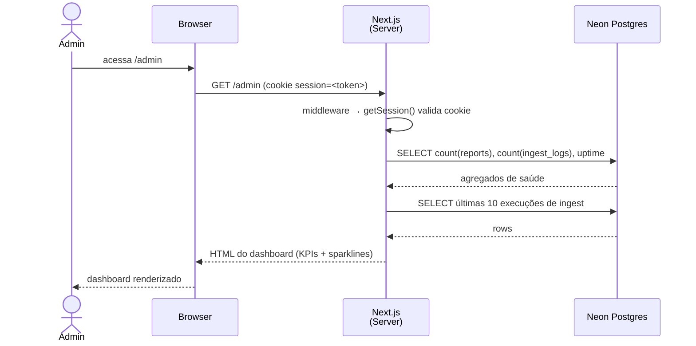

## 5.13 Diagrama "UC-13 Monitorar pipeline de ingest"

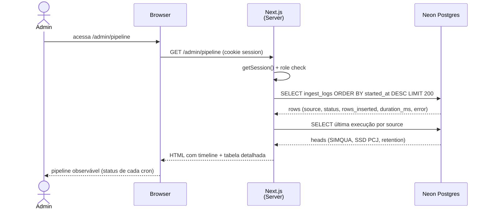

## 5.14 Diagrama "UC-14 Disparar ingest manual"

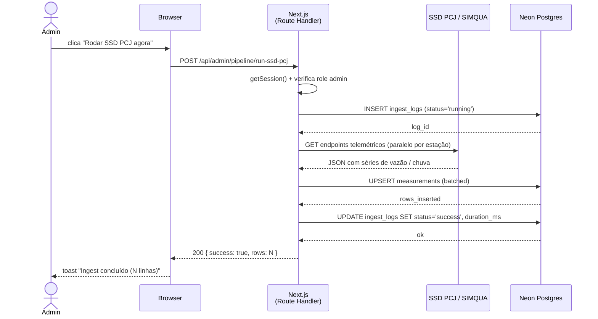

## 5.15 Diagrama "UC-15 Listar boletins gerados"

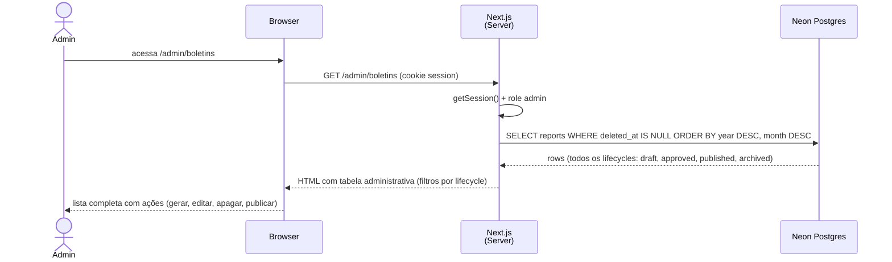

## 5.16 Diagrama "UC-16 Gerar/regenerar boletim"

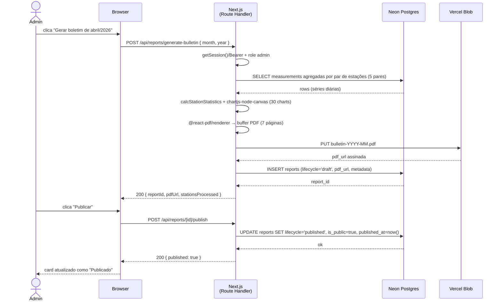

## 5.17 Diagrama "UC-17 Editar template do boletim"

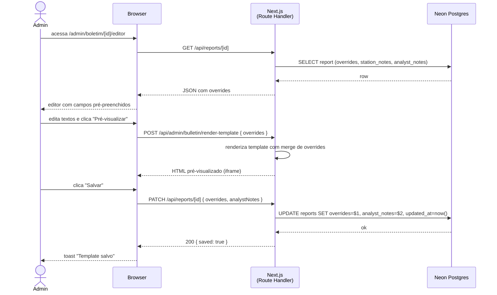

## 5.18 Diagrama "UC-18 Apagar boletim"

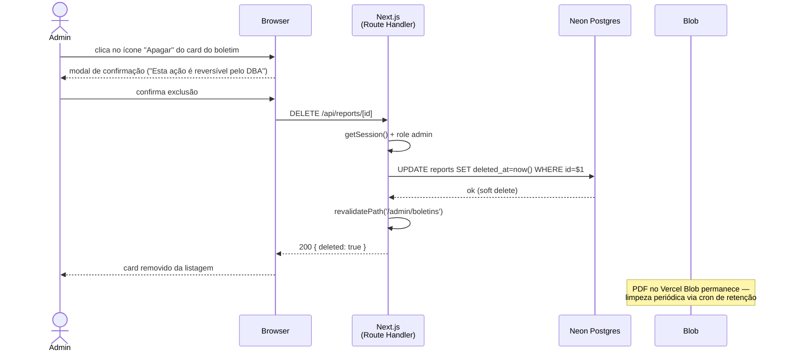

## 5.19 Diagrama "UC-19 Visualizar atividade administrativa"

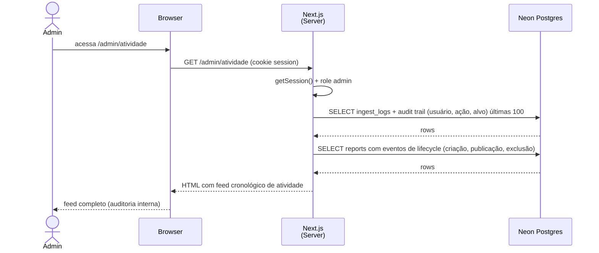

## 5.20 Diagrama "UC-20 Visualizar onboarding/checklist"

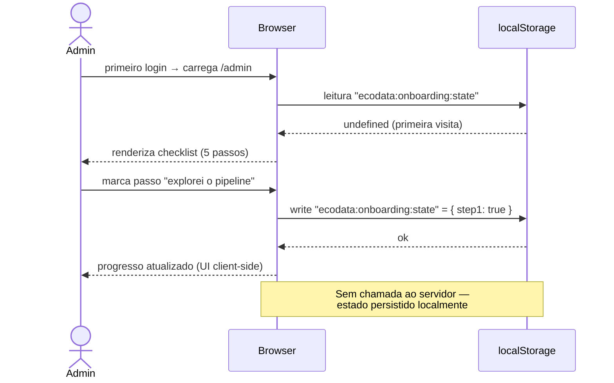

---

## Referências cruzadas

- `03-casos-de-uso-diagramas.md` — visão geral dos atores e relações `<<include>>`
- `04-casos-de-uso-descricoes.md` — descrição textual (fluxos, pré/pós-condições) de cada UC
- `06-arquitetura.md` — camadas, deploy e integrações (contexto dos participantes)
- `07-banco-de-dados.md` — schema e tabelas acessadas pelos diagramas (`reports`, `ingest_logs`, `measurements`, `stations`, `sessions`)
- `08-casos-de-teste.md` — casos de teste alinhados 1-para-1

## Para agentes de IA

<!-- agent-extractable -->
```yaml
section_id: section-05-sequence-diagrams
total_diagrams: 20
alignment: 5.N matches UC-NN in AGENT-CONTEXT.md
participants_legend:
  V: Visitante
  Admin: Administrador
  B: Browser
  N: Next.js Server
  DB: Neon Postgres
  Cache: Vercel Edge CDN
  Blob: Vercel Blob
  Cron: Vercel Cron
  ExtAPI: SSD PCJ / SIMQUA / OSM
  LS: localStorage (client)
  L: Leaflet (client)
  URL: History API (client)
diagrams:
  - id: 5.1
    use_case: uc-01
    participants: [V, B, Cache, N, DB]
  - id: 5.2
    use_case: uc-02
    participants: [V, B, L]
  - id: 5.3
    use_case: uc-03
    participants: [V, B, N, DB]
  - id: 5.4
    use_case: uc-04
    participants: [V, B, N, DB]
  - id: 5.5
    use_case: uc-05
    participants: [V, B, Cache, N]
  - id: 5.6
    use_case: uc-06
    participants: [V, B, N, DB]
  - id: 5.7
    use_case: uc-07
    participants: [V, B, Blob]
  - id: 5.8
    use_case: uc-08
    participants: [V, B, N, DB]
  - id: 5.9
    use_case: uc-09
    participants: [V, B, URL]
  - id: 5.10
    use_case: uc-10
    participants: [V, B, Cache, N]
  - id: 5.11
    use_case: uc-11
    participants: [Admin, B, N, DB]
  - id: 5.12
    use_case: uc-12
    participants: [Admin, B, N, DB]
  - id: 5.13
    use_case: uc-13
    participants: [Admin, B, N, DB]
  - id: 5.14
    use_case: uc-14
    participants: [Admin, B, N, ExtAPI, DB]
  - id: 5.15
    use_case: uc-15
    participants: [Admin, B, N, DB]
  - id: 5.16
    use_case: uc-16
    participants: [Admin, B, N, DB, Blob]
  - id: 5.17
    use_case: uc-17
    participants: [Admin, B, N, DB]
  - id: 5.18
    use_case: uc-18
    participants: [Admin, B, N, DB]
  - id: 5.19
    use_case: uc-19
    participants: [Admin, B, N, DB]
  - id: 5.20
    use_case: uc-20
    participants: [Admin, B, LS]
```
<!-- /agent-extractable -->
