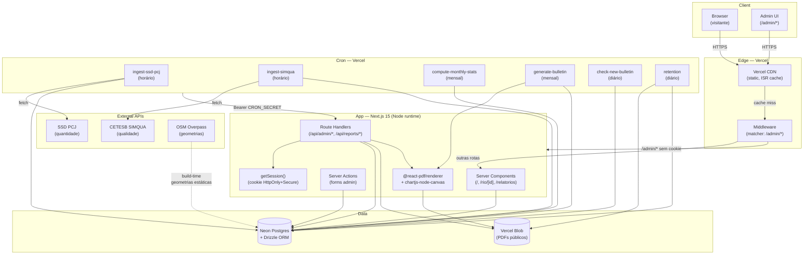

# 6. Arquitetura

> **Para agentes de IA**: este documento descreve a arquitetura técnica do EcoData. Define cinco camadas (Client, Edge, App, Data, External) interconectadas por um conjunto de seis cron jobs e endpoints autenticados. A seção 6.1 traz o diagrama Mermaid canônico de camadas; 6.2 enumera os componentes; 6.3 detalha o modelo de autenticação dual (sessão de cookie OU Bearer secret); 6.4 documenta a estratégia de cache por superfície; 6.5 descreve o pipeline de deploy na Vercel; 6.6 resume o pipeline de dados em três estágios. Use o bloco YAML no rodapé para extração estruturada de `layers`, `external_apis`, `auth_methods` e `cron_jobs`.

A arquitetura do EcoData segue um padrão de **aplicação fullstack serverless** com renderização híbrida (Server Components + ISR + force-dynamic), banco relacional gerenciado e armazenamento de objetos imutáveis. A escolha por uma stack inteiramente serverless (Vercel + Neon + Vercel Blob) prioriza custo zero no plano Hobby e tempo de manutenção mínimo, alinhada à natureza acadêmica do projeto.

## 6.1 Visão de camadas

O diagrama abaixo apresenta as cinco camadas principais e os fluxos de dados entre elas. Setas indicam a direção predominante do tráfego.



**Leitura sintética.** O visitante toca apenas a borda da Vercel; o admin atravessa o middleware e acessa Route Handlers protegidos por `getSession()`. Os crons disparam endpoints autenticados por Bearer secret, alimentando o Postgres a partir das APIs externas. PDFs gerados pelo pipeline são gravados no Vercel Blob e referenciados via URL pública imutável.

## 6.2 Componentes principais

- **Next.js 15 App Router** — renderização por padrão em Server Components no runtime Node. Páginas públicas usam ISR ou revalidação por tag; superfícies administrativas e `/relatorios` são `force-dynamic` para refletir publicações imediatamente.
- **React 19** — usado no client apenas em ilhas interativas (mapa Leaflet, formulários de admin, gráficos Recharts).
- **Drizzle ORM sobre Neon Postgres** — driver `@neondatabase/serverless` via HTTP fetch para compatibilidade com edge/serverless. Schema declarativo em `src/db/schema.ts`, migrations geradas por `drizzle-kit`.
- **Vercel Cron** — agendador declarativo via `vercel.json` (ou painel) que executa POSTs autenticados em `/api/cron/*` e `/api/reports/generate-bulletin`.
- **@react-pdf/renderer 4.x** — geração de boletins em PDF no servidor. Exige `serverExternalPackages: ['@react-pdf/renderer', 'pdfkit', 'fontkit']` no `next.config.ts` para preservar a resolução de métricas de fonte AFM em tempo de execução.
- **chartjs-node-canvas + canvas** — renderização server-side de gráficos como PNG, embutidos no PDF do boletim (séries de IQA, OD e vazão).
- **Vercel Blob** — armazenamento de objetos para PDFs publicados. URLs públicas imutáveis (`*.public.blob.vercel-storage.com`) com `Cache-Control` longo definido pelo provedor.
- **Leaflet + GeoJSON** — mapa hidrográfico em `/` e `/admin/estacoes` com basemap CartoDB. Geometrias de trechos de rio importadas do OpenStreetMap via Overpass API em tempo de build (não há fetch externo em runtime).
- **shadcn/ui + Tailwind v4** — sistema de componentes para a UI; tokens semânticos centralizados em CSS variables.
- **Upstash Redis + Ratelimit** — rate limiting nas rotas de Server Actions e endpoints administrativos, evitando floods de regeneração de boletim.

## 6.3 Modelo de autenticação

O EcoData adota um modelo deliberadamente simples — adequado ao escopo acadêmico, mas explicitamente documentado como **gate de apresentação**, não fronteira de segurança de produção (vide comentário em `src/middleware.ts`).

### 6.3.1 Sessões de admin

A sessão é um **cookie opaco**, gravado com flags `HttpOnly`, `Secure` e `SameSite=Lax`, contendo um payload base64-codificado com `{ role: 'admin', userId, exp }`. Não há JWT assinado: o cookie é tratado como token bearer e validado decodificando-se o base64 e checando `role === 'admin'`.

| Atributo            | Valor                                              |
|---------------------|----------------------------------------------------|
| Nome do cookie      | `ecodata_session`                                  |
| Codificação         | base64 de JSON                                     |
| Flags               | `HttpOnly`, `Secure`, `SameSite=Lax`               |
| Validação           | decodifica e checa `role`                          |
| Tempo de vida       | definido em `exp` (server-controlado)              |

### 6.3.2 Middleware

`src/middleware.ts` aplica matcher `/admin/:path*`. Para qualquer rota sob `/admin`, lê o cookie `ecodata_session`, decodifica via `atob` (compatível com Edge runtime) e verifica `role === 'admin'`. Em caso de falha, redireciona para `/login?next=<rota-original>`. O middleware **não toca** em `/api/admin/*`, `/api/cron/*` ou `/api/reports/*` — essas rotas validam autenticação no próprio handler.

### 6.3.3 Endpoints administrativos (`/api/admin/*`)

Cada handler chama `getSession()` no início e responde `401 Unauthorized` se `session?.role !== 'admin'`. Isso garante defesa em profundidade: mesmo que o middleware seja contornado (por exemplo, em chamada direta à API), o handler ainda bloqueia.

### 6.3.4 Endpoints de cron e geração de boletim

Os endpoints `/api/cron/*`, `/api/reports/generate-bulletin` e `/api/reports/preview-pdf` aceitam **dois mecanismos de autenticação alternativos** (correção recente para permitir disparo manual via admin sem exigir secret):

1. **Bearer secret** — header `Authorization: Bearer <CRON_SECRET>`, usado pelo Vercel Cron.
2. **Sessão admin** — cookie `ecodata_session` com `role === 'admin'`, usado quando o administrador clica "Regenerar boletim" no painel.

Se nenhum dos dois for válido, retorna `401`. A lógica vive em um helper compartilhado (`requireCronOrAdmin`) para evitar divergência entre rotas.

### 6.3.5 Dev mode

Em `NODE_ENV !== 'production'`, certos checks de cron são relaxados (o Bearer secret é opcional) para facilitar testes locais com `curl`. Em produção, ambos os caminhos exigem credencial válida.

## 6.4 Estratégia de cache

A cache foi calibrada por superfície de acordo com o trade-off entre **frescor** (refletir ingest e publicação) e **custo de origem** (renderização por requisição). O `force-dynamic` é reservado para rotas onde a latência percebida de "publicar e ver" é parte da UX.

| Surface              | Estratégia                                                                 |
|----------------------|----------------------------------------------------------------------------|
| `/`                  | Dinâmico com revalidação após ingest                                       |
| `/rio/[id]`         | ISR                                                                        |
| `/relatorios`        | `force-dynamic` (refletir publicação admin no instante)                    |
| `/admin/atividade`         | `force-dynamic`                                                            |
| `/admin/*`           | `force-dynamic`                                                            |
| Blob PDFs            | Cache-Control nativo do Vercel Blob (público, imutável)                    |

**Notas.**

- `/` consome o resultado de uma query agregada por bacia. Após cada ingest bem-sucedido, o handler chama `revalidatePath('/')` para invalidar a página sem precisar de revalidação por tempo.
- `/rio/[id]` é uma página de detalhe pesada (séries históricas) e tolera staleness de minutos; ISR com `revalidate = 600` cobre o caso.
- `/relatorios` precisa exibir `lifecycle = 'published'` imediatamente após o admin publicar — `force-dynamic` evita a janela de inconsistência.
- `/admin/*` é sempre `force-dynamic`: nunca queremos servir lista de boletins ou logs de pipeline em cache.
- PDFs no Vercel Blob recebem `Cache-Control: public, max-age=31536000, immutable` automaticamente, já que cada versão tem URL única (hash no path).

## 6.5 Deployment

### 6.5.1 Topologia

- **Hosting** — Vercel, plano Hobby. Região `gru1` (São Paulo) por default para reduzir latência das APIs externas brasileiras.
- **Banco** — Neon Postgres, plano Free, branch `main`. Conexão via `@neondatabase/serverless` (HTTP fetch, sem pooler).
- **Storage** — Vercel Blob, plano Hobby (1 GB grátis). Bucket único, escopo público.
- **Cache externo** — Upstash Redis Free tier, usado apenas para rate limit.

### 6.5.2 CI/CD

```
git push origin main
    ↓
Vercel webhook
    ↓
Build (next build, Turbopack)
    ↓
Deploy automático
    ↓
Preview URL + Production promotion
```

Não há pipeline custom de CI: a Vercel cobre build, lint check via `eslint-config-next` e deploy. Testes (`vitest`, `@playwright/test`) rodam localmente; integração com Vercel Checks fica para evolução futura.

### 6.5.3 Configuração de crons

Os cron jobs são declarados em `vercel.json` (ou no painel do projeto, para evitar consumir minutos do Hobby plan com agendamentos inativos). Schedule sintetizado:

| Job                       | Schedule (cron)   | Endpoint                               |
|---------------------------|-------------------|----------------------------------------|
| `ingest-ssd-pcj`          | `0 * * * *`       | `/api/cron/ingest-ssd-pcj`             |
| `ingest-simqua`           | `15 * * * *`      | `/api/cron/ingest-simqua`              |
| `compute-monthly-stats`   | `0 3 1 * *`       | `/api/cron/compute-monthly-stats`      |
| `generate-bulletin`       | `0 4 1 * *`       | `/api/reports/generate-bulletin`       |
| `check-new-bulletin`      | `0 9 * * *`       | `/api/cron/check-new-bulletin`         |
| `retention`               | `0 5 * * 0`       | `/api/cron/retention`                  |

### 6.5.4 Variáveis de ambiente

| Variável                         | Função                                            |
|----------------------------------|---------------------------------------------------|
| `DATABASE_URL`                   | Connection string Neon                            |
| `BLOB_READ_WRITE_TOKEN`          | Auth do Vercel Blob                               |
| `CRON_SECRET`                    | Bearer dos endpoints de cron                      |
| `UPSTASH_REDIS_REST_URL/TOKEN`   | Rate limit                                        |
| `GOOGLE_GENERATIVE_AI_API_KEY`   | Gemini (resumo opcional do boletim)               |

### 6.5.5 Headers de segurança

Definidos centralmente em `next.config.ts` (vide `async headers()`): CSP estrita liberando apenas Google Fonts, Upstash, CartoDB e o domínio do Vercel Blob; `X-Frame-Options: SAMEORIGIN`, `X-Content-Type-Options: nosniff`, `Referrer-Policy: strict-origin-when-cross-origin`. Compressão HTTP habilitada (`compress: true`).

## 6.6 Pipeline de dados (resumo)

O pipeline opera em três estágios encadeados, com escrita exclusiva em tabelas Postgres entre estágios — não há filas, brokers ou stream.

### Estágio 1 — Ingest horário

Dois crons independentes, executados a cada hora com 15 min de defasagem:

- **`ingest-ssd-pcj`** — fetch HTTP no SSD PCJ; parse de medições de **quantidade** (vazão, nível); upsert em `measurements` com `source = 'ssd_pcj'`.
- **`ingest-simqua`** — fetch HTTP no CETESB SIMQUA; parse de medições de **qualidade** (OD, IQA, turbidez, pH); upsert em `measurements` com `source = 'simqua'`.

Cada execução grava uma linha em `ingest_logs` com `status`, `rows_inserted`, `error_message`, `duration_ms`. Falhas não interrompem o cron seguinte — cada ingest é idempotente sobre `(station_id, timestamp, parameter)`.

### Estágio 2 — Agregação mensal

`compute-monthly-stats` roda no dia 1 de cada mês, agrega `measurements` do mês anterior por estação e parâmetro, e grava em `monthly_stats` (média, mín, máx, p50, p90, count). É a base do boletim.

### Estágio 3 — Geração de boletim

`generate-bulletin` lê `monthly_stats`, renderiza gráficos via `chartjs-node-canvas`, monta o PDF com `@react-pdf/renderer`, faz upload para Vercel Blob, e insere uma linha em `reports` com `lifecycle = 'draft'`, `blob_url` e metadados. O admin então transita o lifecycle para `approved` → `published` via `/admin/relatorios`.

### Observabilidade

A página `/admin/pipeline` é a janela operacional sobre o pipeline: lê `ingest_logs` ordenado por `created_at DESC`, exibindo última execução de cada cron, sparkline de duração, taxa de sucesso e link para retry manual. Não há APM externo — toda telemetria vive no próprio Postgres.

---

## Referências cruzadas

- [`02-visao-geral.md`](./02-visao-geral.md) — visão geral do produto e modelo de operação
- [`05-diagramas-sequencia.md`](./05-diagramas-sequencia.md) — diagramas de sequência de cada caso de uso
- [`07-banco-de-dados.md`](./07-banco-de-dados.md) — schema completo + diagrama ER
- [`src/middleware.ts`](../../src/middleware.ts) — gate de `/admin/*`
- [`next.config.ts`](../../next.config.ts) — CSP, headers, `serverExternalPackages`

## Para agentes de IA

<!-- agent-extractable -->
```yaml
section_id: section-06-arquitetura
layers:
  - id: client
    name: Client
    components: [browser, admin-ui]
  - id: edge
    name: Edge
    components: [vercel-cdn, middleware]
  - id: app
    name: App
    runtime: nodejs
    components:
      - next-15-app-router
      - server-components
      - server-actions
      - route-handlers
      - react-pdf-renderer
      - chartjs-node-canvas
  - id: data
    name: Data
    components:
      - neon-postgres
      - drizzle-orm
      - vercel-blob
  - id: external
    name: External
    components: [cetesb-simqua, ssd-pcj, osm-overpass]
external_apis:
  - id: cetesb-simqua
    purpose: qualidade da agua
    cadence: hourly
  - id: ssd-pcj
    purpose: quantidade (vazao, nivel)
    cadence: hourly
  - id: osm-overpass
    purpose: geometrias de rios
    cadence: build-time
auth_methods:
  - id: admin-session
    type: cookie
    cookie_name: ecodata_session
    encoding: base64-json
    flags: [HttpOnly, Secure, SameSite=Lax]
    enforced_by: [middleware, route-handlers]
  - id: cron-bearer
    type: bearer-secret
    env_var: CRON_SECRET
    applies_to: [/api/cron/*, /api/reports/generate-bulletin, /api/reports/preview-pdf]
  - id: cron-or-admin
    type: composite
    note: "endpoints de cron/geracao aceitam Bearer OU sessao admin"
cron_jobs:
  - id: ingest-ssd-pcj
    schedule: "0 * * * *"
    endpoint: /api/cron/ingest-ssd-pcj
    writes_to: [measurements, ingest_logs]
  - id: ingest-simqua
    schedule: "15 * * * *"
    endpoint: /api/cron/ingest-simqua
    writes_to: [measurements, ingest_logs]
  - id: compute-monthly-stats
    schedule: "0 3 1 * *"
    endpoint: /api/cron/compute-monthly-stats
    writes_to: [monthly_stats]
  - id: generate-bulletin
    schedule: "0 4 1 * *"
    endpoint: /api/reports/generate-bulletin
    writes_to: [reports, vercel-blob]
  - id: check-new-bulletin
    schedule: "0 9 * * *"
    endpoint: /api/cron/check-new-bulletin
    writes_to: [ingest_logs]
  - id: retention
    schedule: "0 5 * * 0"
    endpoint: /api/cron/retention
    writes_to: [measurements, ingest_logs, vercel-blob]
cache_strategy:
  - surface: "/"
    mode: dynamic-with-revalidate
  - surface: "/rio/[id]"
    mode: isr
    revalidate_seconds: 600
  - surface: "/relatorios"
    mode: force-dynamic
  - surface: "/admin/atividade"
    mode: force-dynamic
  - surface: "/admin/*"
    mode: force-dynamic
  - surface: blob-pdfs
    mode: immutable-cdn
relationships:
  - from: middleware
    to: admin-ui
    type: gates
  - from: cron-jobs
    to: app-route-handlers
    type: invokes-via-bearer
  - from: app-route-handlers
    to: neon-postgres
    type: writes
  - from: app-route-handlers
    to: vercel-blob
    type: uploads-pdf
```
<!-- /agent-extractable -->
