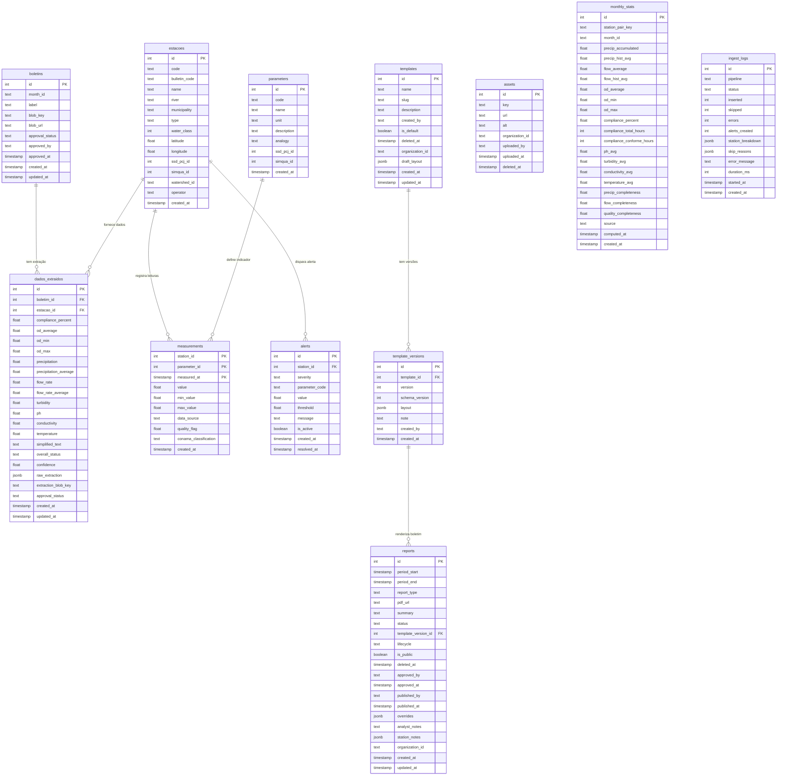

# 7. Banco de Dados

Esta seção documenta o modelo de dados do EcoData. O *source of truth* do
schema é o arquivo `src/db/schema.ts`, que define todas as tabelas via
`drizzle-orm/pg-core` e a partir do qual as migrations SQL são geradas. O banco
de produção é um **PostgreSQL Serverless** hospedado no **Neon**, acessado pelo
driver edge-compatível do Drizzle.

A apresentação está dividida em quatro partes:

1. **§7.1** — Diagrama Entidade-Relacionamento em Mermaid, com todas as tabelas
   e relacionamentos.
2. **§7.2** — Dicionário de tabelas, com finalidade, colunas, índices e
   relacionamentos.
3. **§7.3** — Estratégia de migrations (geração, aplicação, branching).
4. **§7.4** — Considerações de design (latência, particionamento, backup, RLS).

---

## 7.1 Diagrama Entidade-Relacionamento

O diagrama abaixo enumera as **doze tabelas** existentes no schema e seus
relacionamentos. Tipos foram simplificados para compatibilidade com Mermaid
(`int`, `text`, `timestamp`, `float`, `boolean`, `jsonb`).



> Observação: os relacionamentos lógicos entre `monthly_stats.station_pair_key`
> e `estacoes`, bem como entre `ingest_logs` e `estacoes` (via
> `station_breakdown` JSON), **não** são modelados como foreign keys no
> Postgres. São associações por chave textual (slug do par de estações) ou
> dentro de JSON livre — preservam flexibilidade para *station pairs* sintéticos
> e *breakdowns* dinâmicos.

---

## 7.2 Dicionário de tabelas

### 7.2.1 Tabela `estacoes`

**Finalidade:** Cadastro mestre das estações de monitoramento da bacia PCJ,
unificando estações de qualidade (CETESB/SIMQUA) e quantidade (DAEE/SSD PCJ).

**Colunas principais:**

| Coluna           | Tipo                            | Restrições                       |
|------------------|---------------------------------|----------------------------------|
| `id`             | `serial`                        | PK                               |
| `code`           | `varchar(20)`                   | NOT NULL, UNIQUE                 |
| `bulletin_code`  | `varchar(20)`                   | nullable                         |
| `name`           | `text`                          | NOT NULL                         |
| `river`          | `text`                          | NOT NULL                         |
| `municipality`   | `text`                          | NOT NULL                         |
| `type`           | `station_type` (enum)           | NOT NULL — `quality` \| `quantity` |
| `water_class`    | `integer`                       | nullable — classe CONAMA (2 ou 3) |
| `latitude`       | `real`                          | nullable — WGS84                 |
| `longitude`      | `real`                          | nullable — WGS84                 |
| `ssd_pcj_id`     | `integer`                       | nullable — id externo SSD PCJ    |
| `simqua_id`      | `integer`                       | nullable — id externo SIMQUA     |
| `watershed_id`   | `text`                          | nullable                         |
| `operator`       | `text`                          | nullable — `CETESB` \| `DAEE`    |
| `created_at`     | `timestamp`                     | NOT NULL, default `now()`        |

**Índices:** índice único implícito em `code`.

**Relacionamentos:** referenciada por `dados_extraidos`, `measurements`,
`alerts`.

---

### 7.2.2 Tabela `boletins`

**Finalidade:** Metadados dos boletins mensais oficiais armazenados no Vercel
Blob — uma linha por mês calendário.

**Colunas principais:**

| Coluna             | Tipo                            | Restrições                  |
|--------------------|---------------------------------|-----------------------------|
| `id`               | `serial`                        | PK                          |
| `month_id`         | `varchar(7)`                    | NOT NULL, UNIQUE — `YYYY-MM` |
| `label`            | `text`                          | NOT NULL                    |
| `blob_key`         | `text`                          | nullable                    |
| `blob_url`         | `text`                          | nullable                    |
| `approval_status`  | `approval_status` (enum)        | NOT NULL, default `pending` |
| `approved_by`      | `text`                          | nullable                    |
| `approved_at`      | `timestamp`                     | nullable                    |
| `created_at`       | `timestamp`                     | NOT NULL, default `now()`   |
| `updated_at`       | `timestamp`                     | NOT NULL, default `now()`   |

**Índices:** índice único implícito em `month_id`.

**Relacionamentos:** referenciada por `dados_extraidos`.

---

### 7.2.3 Tabela `dados_extraidos`

**Finalidade:** Dados de qualidade e quantidade **extraídos por IA (Gemini)**
de cada PDF de boletim, por estação. Sujeitos a *gate* de aprovação humana
antes de servirem como fonte canônica.

**Colunas principais:**

| Coluna                  | Tipo                            | Restrições                       |
|-------------------------|---------------------------------|----------------------------------|
| `id`                    | `serial`                        | PK                               |
| `boletim_id`            | `integer`                       | NOT NULL, FK → `boletins.id`     |
| `estacao_id`            | `integer`                       | NOT NULL, FK → `estacoes.id`     |
| `compliance_percent`    | `numeric(5,2)`                  | nullable                         |
| `od_average`            | `numeric(6,3)`                  | nullable                         |
| `od_min`                | `numeric(6,3)`                  | nullable                         |
| `od_max`                | `numeric(6,3)`                  | nullable                         |
| `precipitation`         | `numeric(8,2)`                  | nullable                         |
| `precipitation_average` | `numeric(8,2)`                  | nullable                         |
| `flow_rate`             | `numeric(10,3)`                 | nullable                         |
| `flow_rate_average`     | `numeric(10,3)`                 | nullable                         |
| `turbidity`             | `numeric(8,2)`                  | nullable                         |
| `ph`                    | `numeric(4,2)`                  | nullable                         |
| `conductivity`          | `numeric(8,2)`                  | nullable                         |
| `temperature`           | `numeric(5,2)`                  | nullable                         |
| `simplified_text`       | `text`                          | nullable                         |
| `overall_status`        | `status_level` (enum)           | nullable — `good` \| `warning` \| `critical` |
| `confidence`            | `numeric(4,3)`                  | nullable — 0.000 a 1.000         |
| `raw_extraction`        | `jsonb`                         | nullable — JSON bruto do Gemini  |
| `extraction_blob_key`   | `text`                          | nullable                         |
| `approval_status`       | `approval_status` (enum)        | NOT NULL, default `pending`      |
| `created_at`            | `timestamp`                     | NOT NULL, default `now()`        |
| `updated_at`            | `timestamp`                     | NOT NULL, default `now()`        |

**Índices:** FK implícitas em `boletim_id` e `estacao_id`.

**Relacionamentos:** referencia `boletins` e `estacoes`.

---

### 7.2.4 Tabela `parameters`

**Finalidade:** Catálogo de parâmetros de qualidade da água (`OD`, `pH`,
`turbidez`, etc.), com unidade, descrição e analogia para o cidadão.

**Colunas principais:**

| Coluna         | Tipo                            | Restrições                      |
|----------------|---------------------------------|---------------------------------|
| `id`           | `serial`                        | PK                              |
| `code`         | `varchar(30)`                   | NOT NULL, UNIQUE                |
| `name`         | `text`                          | NOT NULL                        |
| `unit`         | `varchar(20)`                   | NOT NULL                        |
| `description`  | `text`                          | nullable                        |
| `analogy`      | `text`                          | nullable                        |
| `ssd_pcj_id`   | `integer`                       | nullable                        |
| `simqua_id`    | `integer`                       | nullable                        |
| `created_at`   | `timestamp`                     | NOT NULL, default `now()`       |

**Índices:** índice único implícito em `code`.

**Relacionamentos:** referenciada por `measurements`.

---

### 7.2.5 Tabela `measurements`

**Finalidade:** Leituras de séries temporais brutas das estações (uma linha
por estação × parâmetro × timestamp). Tabela de maior volume do sistema.

**Colunas principais:**

| Coluna                  | Tipo                            | Restrições                       |
|-------------------------|---------------------------------|----------------------------------|
| `station_id`            | `integer`                       | PK (composta), FK → `estacoes.id` |
| `parameter_id`          | `integer`                       | PK (composta), FK → `parameters.id` |
| `measured_at`           | `timestamp`                     | PK (composta)                    |
| `value`                 | `real`                          | NOT NULL                         |
| `min_value`             | `real`                          | nullable — mínimo agregado       |
| `max_value`             | `real`                          | nullable — máximo agregado       |
| `data_source`           | `text`                          | NOT NULL — `simqua`, `ssd_pcj`, `infoaguas`, `bulletin` |
| `quality_flag`          | `real`                          | nullable — SIMQUA: 1=válido, 2=sem dado, 4=suspeito |
| `conama_classification` | `conama_severity` (enum)        | nullable                         |
| `created_at`            | `timestamp`                     | NOT NULL, default `now()`        |

**Índices:**

- **PK composta** `(station_id, parameter_id, measured_at)` — garante
  deduplicação na ingestão.
- `idx_measurements_station_time` em `(station_id, measured_at)` — acelera
  *queries* por estação em janela temporal (caso de uso UC-03).

**Relacionamentos:** referencia `estacoes` e `parameters`.

---

### 7.2.6 Tabela `alerts`

**Finalidade:** Registro de violações dos limites CONAMA 357 detectadas
durante a avaliação de uma medição. Alimenta a atividade recente e o popup
do mapa.

**Colunas principais:**

| Coluna            | Tipo                            | Restrições                       |
|-------------------|---------------------------------|----------------------------------|
| `id`              | `serial`                        | PK                               |
| `station_id`      | `integer`                       | NOT NULL, FK → `estacoes.id`     |
| `severity`        | `conama_severity` (enum)        | NOT NULL                         |
| `parameter_code`  | `varchar(30)`                   | NOT NULL                         |
| `value`           | `real`                          | NOT NULL                         |
| `threshold`       | `real`                          | nullable                         |
| `message`         | `text`                          | NOT NULL — pt-BR para cidadão    |
| `is_active`       | `boolean`                       | NOT NULL, default `true`         |
| `created_at`      | `timestamp`                     | NOT NULL, default `now()`        |
| `resolved_at`     | `timestamp`                     | nullable                         |

**Índices:** FK implícita em `station_id`.

**Relacionamentos:** referencia `estacoes`.

---

### 7.2.7 Tabela `reports`

**Finalidade:** Metadados editoriais e técnicos dos boletins gerados pelo
*pipeline* — combina ciclo de vida editorial (`lifecycle`), *status* de
geração técnica (`status`) e *overrides* por instância. Esta tabela é o
núcleo do **Boletim Builder**.

**Colunas principais:**

| Coluna                  | Tipo                            | Restrições                       |
|-------------------------|---------------------------------|----------------------------------|
| `id`                    | `serial`                        | PK                               |
| `period_start`          | `timestamp`                     | NOT NULL                         |
| `period_end`            | `timestamp`                     | NOT NULL                         |
| `report_type`           | `varchar(20)`                   | NOT NULL — `citizen` \| `technical` \| `bulletin` |
| `pdf_url`               | `text`                          | nullable                         |
| `summary`               | `text`                          | nullable                         |
| `status`                | `varchar(20)`                   | NOT NULL, default `pending` — `pending` \| `generating` \| `ready` \| `error` |
| `template_version_id`   | `integer`                       | nullable — FK lógica → `template_versions.id` |
| `lifecycle`             | `bulletin_lifecycle` (enum)     | NOT NULL, default `draft` — `draft` \| `approved` \| `published` \| `archived` |
| `is_public`             | `boolean`                       | NOT NULL, default `false`        |
| `deleted_at`            | `timestamp`                     | nullable — *soft delete*         |
| `approved_by`           | `text`                          | nullable                         |
| `approved_at`           | `timestamp`                     | nullable                         |
| `published_by`          | `text`                          | nullable                         |
| `published_at`          | `timestamp`                     | nullable                         |
| `overrides`             | `jsonb`                         | nullable — `{ blockId: { content?, imageBlobKey?, hidden? } }` |
| `analyst_notes`         | `text`                          | nullable                         |
| `station_notes`         | `jsonb`                         | nullable — `{ stationKey: noteText }` |
| `organization_id`       | `varchar(30)`                   | NOT NULL, default `'pcj'`        |
| `created_at`            | `timestamp`                     | NOT NULL, default `now()`        |
| `updated_at`            | `timestamp`                     | NOT NULL, default `now()`        |

**Índices:** nenhum índice nomeado no schema atual; *queries* da UI filtram
por `deleted_at IS NULL` e `lifecycle`.

**Relacionamentos:** referencia (logicamente) `template_versions`. A FK não é
forçada no Postgres por convenção do schema atual — boletins *legacy* sem
template podem existir com `template_version_id = NULL`.

---

### 7.2.8 Tabela `templates`

**Finalidade:** Container lógico de *templates* visuais de boletim. O conteúdo
real do *layout* vive em `template_versions` para histórico limpo de versões.
Suporta *draft* não publicado via `draft_layout`.

**Colunas principais:**

| Coluna             | Tipo                            | Restrições                       |
|--------------------|---------------------------------|----------------------------------|
| `id`               | `serial`                        | PK                               |
| `name`             | `text`                          | NOT NULL                         |
| `slug`             | `varchar(60)`                   | NOT NULL, UNIQUE                 |
| `description`      | `text`                          | nullable                         |
| `created_by`       | `text`                          | nullable                         |
| `is_default`       | `boolean`                       | NOT NULL, default `false`        |
| `deleted_at`       | `timestamp`                     | nullable — *soft delete*         |
| `organization_id`  | `varchar(30)`                   | NOT NULL, default `'pcj'`        |
| `draft_layout`     | `jsonb`                         | nullable — *work-in-progress* do editor v2 |
| `created_at`       | `timestamp`                     | NOT NULL, default `now()`        |
| `updated_at`       | `timestamp`                     | NOT NULL, default `now()`        |

**Índices:** índice único implícito em `slug`.

**Relacionamentos:** referenciada por `template_versions`.

---

### 7.2.9 Tabela `template_versions`

**Finalidade:** *Snapshot* versionado do *layout* de um *template*. Cada save
incrementa `version`. Permite *rollback* sem destruir histórico.

**Colunas principais:**

| Coluna             | Tipo                            | Restrições                       |
|--------------------|---------------------------------|----------------------------------|
| `id`               | `serial`                        | PK                               |
| `template_id`      | `integer`                       | NOT NULL, FK → `templates.id`    |
| `version`          | `integer`                       | NOT NULL — sequencial por *template* |
| `schema_version`   | `integer`                       | NOT NULL, default `1`            |
| `layout`           | `jsonb`                         | NOT NULL — validado em runtime por Zod |
| `note`             | `text`                          | nullable — *changelog* da versão |
| `created_by`       | `text`                          | nullable                         |
| `created_at`       | `timestamp`                     | NOT NULL, default `now()`        |

**Índices:** `idx_template_versions_template` em `(template_id, version)` —
*lookup* da última versão por *template*.

**Relacionamentos:** referencia `templates`; referenciada (logicamente) por
`reports.template_version_id`.

---

### 7.2.10 Tabela `assets`

**Finalidade:** Biblioteca de *assets* (imagens, logos) referenciados pelos
blocos do *template*. Desacopla blobs de URLs *hot-linkadas* no JSON.

**Colunas principais:**

| Coluna             | Tipo                            | Restrições                       |
|--------------------|---------------------------------|----------------------------------|
| `id`               | `serial`                        | PK                               |
| `key`              | `text`                          | NOT NULL, UNIQUE — chave estável do Blob |
| `url`              | `text`                          | NOT NULL                         |
| `alt`              | `text`                          | nullable — *alt text* pt-BR      |
| `organization_id`  | `varchar(30)`                   | NOT NULL, default `'pcj'`        |
| `uploaded_by`      | `text`                          | nullable                         |
| `uploaded_at`      | `timestamp`                     | NOT NULL, default `now()`        |
| `deleted_at`       | `timestamp`                     | nullable — *soft delete*         |

**Índices:** índice único implícito em `key`.

**Relacionamentos:** referenciada (logicamente) por `template_versions.layout`
através de `assetKey` em blocos JSON.

---

### 7.2.11 Tabela `monthly_stats`

**Finalidade:** Agregações mensais materializadas — *first-class numbers*
calculados conforme a metodologia oficial do Boletim Integrado (soma da
precipitação, média da vazão, % conformidade de OD por horas). Discriminada
por `source` (`computed` vs. `historical`) para coexistir *backfill* e
recálculo.

**Colunas principais:**

| Coluna                       | Tipo                            | Restrições                       |
|------------------------------|---------------------------------|----------------------------------|
| `id`                         | `serial`                        | PK                               |
| `station_pair_key`           | `varchar(30)`                   | NOT NULL — `atibaia`, `jaguari`, … |
| `month_id`                   | `varchar(7)`                    | NOT NULL — `YYYY-MM`             |
| `precip_accumulated`         | `real`                          | nullable — soma diária (mm)      |
| `precip_hist_avg`            | `real`                          | nullable — média histórica 2016-2025 |
| `flow_average`               | `real`                          | nullable — média horária (m³/s)  |
| `flow_hist_avg`              | `real`                          | nullable                         |
| `od_average`                 | `real`                          | nullable — média mensal OD (mg/L) |
| `od_min`                     | `real`                          | nullable                         |
| `od_max`                     | `real`                          | nullable                         |
| `compliance_percent`         | `real`                          | nullable — % horas conformes     |
| `compliance_total_hours`     | `integer`                       | nullable                         |
| `compliance_conforme_hours`  | `integer`                       | nullable                         |
| `ph_avg`                     | `real`                          | nullable                         |
| `turbidity_avg`              | `real`                          | nullable                         |
| `conductivity_avg`           | `real`                          | nullable                         |
| `temperature_avg`            | `real`                          | nullable                         |
| `precip_completeness`        | `real`                          | nullable — 0–100                 |
| `flow_completeness`          | `real`                          | nullable — 0–100                 |
| `quality_completeness`       | `real`                          | nullable — 0–100                 |
| `source`                     | `varchar(20)`                   | NOT NULL, default `computed`     |
| `computed_at`                | `timestamp`                     | NOT NULL, default `now()`        |
| `created_at`                 | `timestamp`                     | NOT NULL, default `now()`        |

**Índices:**

- `idx_monthly_stats_pair_month` em `(station_pair_key, month_id)` — *lookup*
  por par de estações.
- `idx_monthly_stats_source_month` em `(source, month_id)` — separar
  `computed` de `historical`.
- `uq_monthly_stats_pair_month_source` em
  `(station_pair_key, month_id, source)` — UNIQUE composta: garante *upsert*
  idempotente.

**Relacionamentos:** referência lógica a `estacoes` via `station_pair_key`
(par de slugs de estações), **sem FK forçada** — preserva flexibilidade para
pares sintéticos.

---

### 7.2.12 Tabela `ingest_logs`

**Finalidade:** Log de execução de cada *pipeline* (cron, re-run manual,
backfill). Alimenta o painel `/admin/pipeline` (caso de uso UC-13) e permite
investigação retroativa de falhas.

**Colunas principais:**

| Coluna               | Tipo                            | Restrições                       |
|----------------------|---------------------------------|----------------------------------|
| `id`                 | `serial`                        | PK                               |
| `pipeline`           | `varchar(30)`                   | NOT NULL — `simqua`, `ssd_pcj`, `monthly_stats`, `historical_seed` |
| `status`             | `varchar(30)`                   | NOT NULL — `success`, `partial`, `error`, `source_unavailable` |
| `inserted`           | `integer`                       | NOT NULL, default `0`            |
| `skipped`            | `integer`                       | NOT NULL, default `0`            |
| `errors`             | `integer`                       | NOT NULL, default `0`            |
| `alerts_created`     | `integer`                       | NOT NULL, default `0`            |
| `station_breakdown`  | `jsonb`                         | nullable — `{ "EF31": { inserted, skipped, error? } }` |
| `skip_reasons`       | `jsonb`                         | nullable — `{ "stale_data": 5, … }` |
| `error_message`      | `text`                          | nullable                         |
| `duration_ms`        | `integer`                       | nullable                         |
| `started_at`         | `timestamp`                     | NOT NULL                         |
| `created_at`         | `timestamp`                     | NOT NULL, default `now()`        |

**Índices:** `idx_ingest_logs_pipeline_started` em `(pipeline, started_at)`
— suporta a *timeline* invertida do painel admin.

**Relacionamentos:** nenhum FK direto. Referência lógica a `estacoes` via
chaves dentro de `station_breakdown`.

---

## 7.3 Estratégia de migrations

**Princípios:**

- **Source of truth único:** `src/db/schema.ts`. Todo *schema change* começa
  como edição neste arquivo.
- **Geração automática:** Migrations SQL são produzidas via
  `pnpm drizzle-kit generate` (subcomando `drizzle-kit`), que faz *diff* do
  schema TypeScript contra o estado anterior e emite SQL idempotente em
  `drizzle/migrations/`.
- **Aplicação em produção:** `pnpm drizzle-kit push` aplica diretamente o
  *diff* contra o banco Neon de produção. Para mudanças destrutivas, usa-se
  `pnpm drizzle-kit migrate` aplicando o SQL versionado.
- **Branches do Neon:** Cada experimento de schema cria um *branch* isolado
  do banco (cópia *copy-on-write*), evitando contaminação do banco principal.
  Branches são descartáveis e cobram apenas pelo *diff* de armazenamento.
- **Não há *down-migrations* automáticas.** Para *rollback*, o repositório
  versiona scripts SQL específicos quando o caminho de volta é destrutivo
  (ver `bulletin_builder_rollback.sql` abaixo).

**Arquivos atuais em `drizzle/migrations/`:**

| Arquivo                                       | Finalidade                                          |
|-----------------------------------------------|-----------------------------------------------------|
| `2026-05-07_bulletin_builder.sql`             | Introduziu `templates`, `template_versions` e estendeu `reports` com colunas do *Boletim Builder* (`lifecycle`, `is_public`, `deleted_at`, *overrides*, etc.). |
| `2026-05-13_template_editor_v2.sql`           | Adicionou tabela `assets` e coluna `draft_layout` em `templates` para o *Template Editor v2*. |
| `bulletin_builder_rollback.sql`               | Script destrutivo de *rollback* do *Bulletin Builder* — usado apenas em ambiente de teste. |

Novas migrations seguem o padrão `YYYY-MM-DD_<slug>.sql` para preservar ordem
cronológica legível no `git log`.

---

## 7.4 Considerações de design

**Latência e *driver*:**

- O banco está no **Neon Serverless Postgres**, com região `us-east-1` (mesma
  do deployment Vercel).
- O Drizzle usa o driver `@neondatabase/serverless` em ambiente *edge* e o
  driver `pg` em rotas Node — em ambos os casos, *cold starts* ficam abaixo
  de 100 ms na *suspend resume* do Neon.
- *Queries* críticas do *map view* (UC-01) usam a PK composta de
  `measurements` para *lookups* O(log n) por estação × janela temporal.

**Particionamento:**

- **Não utilizado nesta versão.** A tabela `measurements` cresce com o tempo,
  mas o *backfill* histórico está limitado à janela **2016-2025** (Phase 20
  seed) e a ingestão corrente é horária por ~24 estações — o que mantém a
  tabela na ordem de **~2 milhões de linhas/ano**, dentro do envelope que o
  Postgres aguenta sem particionamento.
- Caso o EcoData seja estendido a outras bacias (multi-tenant via
  `organization_id`), avalia-se particionar `measurements` por
  `RANGE(measured_at)` em recortes anuais.

**Backup:**

- O Neon executa **snapshots automáticos** com retenção configurável (7 dias
  no plano atual). Branches *point-in-time* permitem restaurar para qualquer
  instante dentro da janela de retenção.
- *Dumps* SQL completos podem ser exportados via `pg_dump` apontando para a
  *connection string* do Neon.

**Row-Level Security (RLS):**

- **Não habilitado.** O acesso ao banco ocorre exclusivamente através da
  camada de aplicação Next.js (Server Components, Server Actions e rotas API
  com `getSession()`). O Postgres do Neon não é exposto a clientes externos.
- A multi-tenancy lógica é feita por `organization_id` (default `'pcj'`) nas
  tabelas `reports`, `templates` e `assets`, com filtragem aplicada na camada
  *query* (Drizzle).

**Tipos: `numeric` vs `real`:**

- Tabelas *legacy* (`dados_extraidos`) usam `numeric(p,s)` para precisão
  exata, pois armazenam valores extraídos por IA cujo arredondamento deve ser
  preservado.
- Tabelas v3 (`measurements`, `monthly_stats`, `alerts`) usam `real` (4
  bytes) para economizar armazenamento — perda de precisão em ~7 dígitos
  significativos é aceitável para sensores ambientais.

**JSONB para *overrides* e *layouts*:**

- `reports.overrides`, `templates.draft_layout`, `template_versions.layout` e
  `ingest_logs.station_breakdown` usam `jsonb` para flexibilidade de schema.
- Validação acontece em *runtime* via **Zod** (`src/lib/bulletin/template-schema.ts`),
  acoplada à coluna `schema_version` que viabiliza migrações de forma do
  *layout* sem perder números de versão visíveis ao usuário.

---

<!-- agent:section_summary -->
```yaml
section: 7
file: docs/tcc/07-banco-de-dados.md
db_engine: PostgreSQL (Neon Serverless)
orm: drizzle-orm
source_of_truth: src/db/schema.ts
migrations_dir: drizzle/migrations/
migration_files:
  - 2026-05-07_bulletin_builder.sql
  - 2026-05-13_template_editor_v2.sql
  - bulletin_builder_rollback.sql
tables:
  - id: estacoes
    finalidade: Cadastro mestre das estações de monitoramento da bacia PCJ (qualidade CETESB e quantidade DAEE/SSD PCJ).
  - id: boletins
    finalidade: Metadados dos PDFs de boletim mensal armazenados no Vercel Blob, com gate de aprovação humana.
  - id: dados_extraidos
    finalidade: Dados de qualidade e quantidade extraídos por IA (Gemini) dos PDFs de boletim, sujeitos a revisão humana.
  - id: parameters
    finalidade: Catálogo de parâmetros de qualidade da água (OD, pH, turbidez) com unidade e analogia para cidadão.
  - id: measurements
    finalidade: Leituras de séries temporais brutas das estações (PK composta station+parameter+measured_at).
  - id: alerts
    finalidade: Registro de violações dos limites CONAMA 357 detectadas durante avaliação de medições.
  - id: reports
    finalidade: Metadados editoriais e técnicos dos boletins gerados pelo pipeline — núcleo do Boletim Builder.
  - id: templates
    finalidade: Container lógico de templates visuais de boletim com draft layout para editor v2.
  - id: template_versions
    finalidade: Snapshot versionado do layout de um template, permitindo rollback sem perda de histórico.
  - id: assets
    finalidade: Biblioteca de assets (imagens, logos) referenciados pelos blocos do template via chave estável.
  - id: monthly_stats
    finalidade: Agregações mensais materializadas (precipitação somada, vazão média, % conformidade OD).
  - id: ingest_logs
    finalidade: Log de execução de cada pipeline (cron, re-run, backfill) para observabilidade admin.
relationships:
  - from_table: dados_extraidos
    to_table: boletins
    type: many-to-one
  - from_table: dados_extraidos
    to_table: estacoes
    type: many-to-one
  - from_table: measurements
    to_table: estacoes
    type: many-to-one
  - from_table: measurements
    to_table: parameters
    type: many-to-one
  - from_table: alerts
    to_table: estacoes
    type: many-to-one
  - from_table: template_versions
    to_table: templates
    type: many-to-one
  - from_table: reports
    to_table: template_versions
    type: many-to-one (logical, no FK enforced)
  - from_table: monthly_stats
    to_table: estacoes
    type: logical (via station_pair_key, no FK)
  - from_table: ingest_logs
    to_table: estacoes
    type: logical (via station_breakdown JSON, no FK)
```
